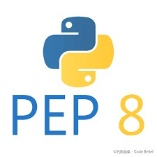

<div style="text-align: center">
    
</div>

# Инструкция телеграм-бота.
## Краткое описание:
Бот даёт возможность запускать веб приложение через телеграмм. 

### Стек:
* python
* aiogram

---

### 
Для начальной настройки бота, Вам необходимо создать виртуальное окружение. 
Поместить токен-бота и указать URL веб приложения (файл .env). 
Далее запускаем бота в файле main.py. Для отслеживания функционирования бота и возможных ошибок,
ведётся логгирование, путём записи данных в файлы (logs/loging.log) 
Параметры логгирования можно изменить в файле utils/logging.py. 

---

### Запуск на Windows (при установленном python):
Открываем терминал, переходим в корневую папку с ботом
1. Создаём окружение ```python -m venv venv```
2. Активируем окружение ```venv\Scripts\activate.bat```
3. Устанавливаем зависимости ```FOR /F %x IN (requirements.txt) DO ( IF NOT # == %x ( pip install %x ) )```
4. Переименовываем файл .env.template в .env
5. Заполняем поля токен-бота и URL веб приложения
6. Запускаем командой из терминала ```python aiogram_bot/main.py```

### Запуск на Linux (при установленном python):
Открываем терминал, переходим в корневую папку с ботом
1. Создаём окружение ```python3 -m venv venv```   
2. Активируем окружение source ```source venv/bin/activate```
3. Устанавливаем зависимости ```pip install -r requirements.txt```
4. Переименовываем файл .env.template в .env
5. Заполняем поля токен-бота и URL веб приложения
6. Запускаем командой из терминала ```python3 aiogram_bot/main.py```

---

### 
Проверено линтерами (black, isort, flake8, mypy).

---

### 
Проект распространяется под лицензией MIT.

---
